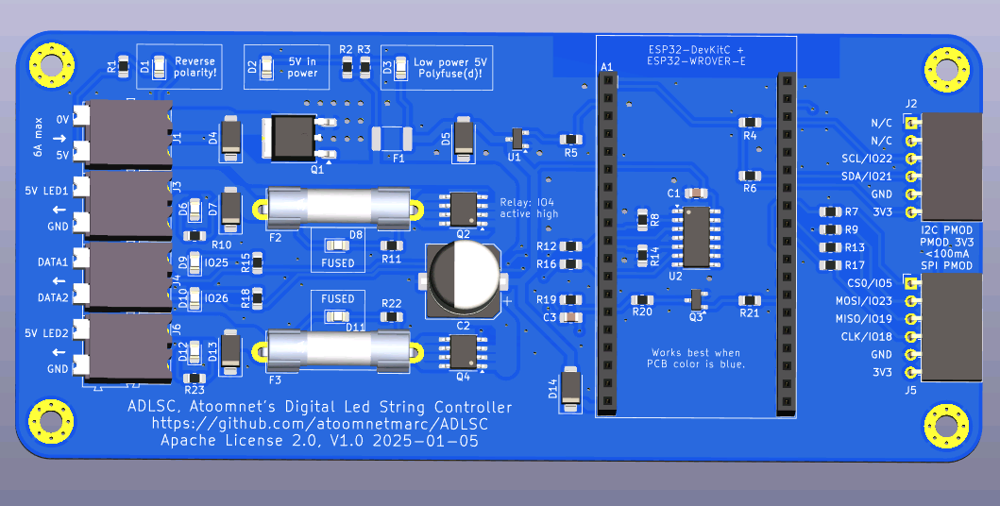

# ADLSC, Atoomnet's Digital Led String Controller

ESP32 based 5V digital LED controller build for use with [WLED](https://kno.wled.ge/).

# Design choices

The chosen ESP32 classic is the ESP32-WROVER-E with PSRAM on a [ESP32-DevKitC V4 board](https://docs.espressif.com/projects/esp-idf/en/release-v4.2/esp32/hw-reference/esp32/get-started-devkitc.html).

The ESP32 must be able to control the power to the LEDs. That means a high-side power switch.

The ESP32 will be powered by the same 5V power supply. A 0.5A 1812 polyfuse with 5V bidirectional TVS diode will used to protect the low power electronics.

5V will be monitored by a MAX809M reset ic. When the power supply voltage is too low the ESP32 will be turned off and in turn the LEDs will be turned off.

A N-channel MOSFET (AOD442) will be used as a 5V reverse polarity protection.

The power to the LEDs can be injected in 2 sections. Both are fused by a 5x20mm slow blow glass fuse paired with 5V bidirectional TVS diodes (like SMBJ5.0CA). Red LEDs will be parallel connected to easily identify a blown fuse.

# BOM

See Kicad directory for PCB BOM.

PCB BOM Notes:

- Instead of Weidmueller 1824810000 clamp terminals you could also use Weidmueller 1760520000 (or generic 5.08mm) pcb screw terminals.
- I made the fuse clip footprint to fit https://www.aliexpress.com/item/4000841928644.html, but other could also fit.

To complete the PCB you will also need:

- 2x 19pin 2.54mm pin header (possibly already included with the ESP32 board)
- 2x 19pin 2.54mm pin socket

Then you will also need:

- Mean Well 5V 10A power supply: IRM-60-5ST
- 5V digital LED strip or matrix

# Wiring

## High voltage

Consult an expert on how to wire mains voltage to the Mean Well 5V power supply.

## Low voltage

Suggestion: use black wire color for GND. Grey for 0V. Red for 5V. Blue for data.

When consulting https://en.wikipedia.org/wiki/American_wire_gauge you should:

- use AWG18 (0.75mm2) or thicker wiring to connect the 5V dc from the power supply using a red and grey wire to the 5V of the power supply
- use AWG20 (0.5mm2) or thicker wiring to connect 5V power to LED strip or matrix.

You may use any wire thickness (challenge accepted) to connect data1 (and data2) to the LED strip. Or use the same AWG20.

## Fuse rating for power supply

If you choose to use a different or lower amperage 5V power supply, then you must also use lower power glass fuses. Reserve 1A for the low power components (like the ESP32) then divide by 3 for the fuse rating. For a 10A power supply: (10A - 1A) / 3 = 3A fuse. Also make sure the power supply can handle short circuits by switching off or go into hiccup mode.

# Firmware

Install `ESP32_WROVER.bin`. Configure current limit at 5A.

# ESP32 pins

| Name     | ESP32 pin | Usage                               |
| -------- | --------- | ----------------------------------- |
| DATA1    | IO25      | LED data                            |
| DATA2    | IO26      | LED clock or data for second string |
| POWER_ON | IO4       | LED power relay                     |
| SDA      | IO21      | I2C data                            |
| SCL      | IO22      | I2C clock                           |
| CS0      | IO4       | SPI chip select 0                   |
| CLK      | IO18      | SPI clock                           |
| MISO     | IO19      | SPI data in                         |
| MOSI     | IO23      | SPI data out                        |

# Expansion PMOD connectors

You could add you own custom functionality using the I2C and SPI PMOD connectors. Consult the schematic on what extra components you should solder to the PCB. These components are excluded from the BOM.

Note: the 3V3 on the I2C and SPI PMOD connectors come from the ESP32 3V3 regulator, keep current usage below 100mA.

